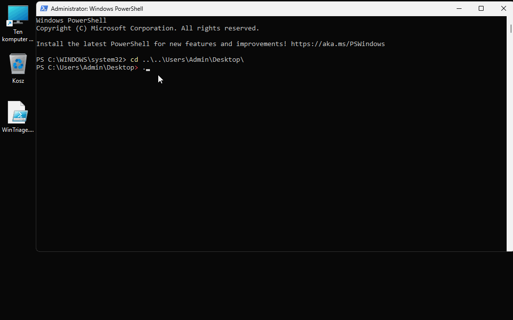

# WinTriage v0.4

**WinTriage** is a lightweight PowerShell forensic triage script designed for rapid data collection from Windows systems during initial incident response. It automates the gathering of critical artifacts, helping SOC analysts and IR responders identify signs of compromise quickly.



## Key Features
- **Process Analysis:** Identifies PowerShell instances and processes running from suspicious locations (Temp, AppData, Downloads, etc.).
- **Persistence Detection:** Scans Autorun registry keys and Scheduled Tasks (with automatic filtering of legitimate Microsoft tasks to reduce noise).
- **Event Log Extraction:** Collects critical security events (Logons, Persistence, Log clearing) from Security, System, and PowerShell Operational logs.
- **Network Insights:** Captures active TCP connections with associated process names and dumps the DNS Client Cache.
- **User Auditing:** Lists local user accounts to identify unauthorized account creation.
- **Automated Reporting:** All data is exported to organized CSV files in a timestamped folder on the Desktop for easy analysis in Excel or Timeline Explorer.

## Usage
1. Download `WinTriage.ps1`.
2. Open PowerShell as **Administrator** (required for accessing Security logs and network data).
3. (Optional) Set execution policy if blocked: 
    ```powershell
    Set-ExecutionPolicy -ExecutionPolicy RemoteSigned -Scope CurrentUser
    ```
4. Run the script:
    ```powershell
    .\WinTriage.ps1
    ```
5. Find your results in the WinTriage-report folder on your Desktop.

### Disclaimer
This tool is intended for educational purposes and security analysis only. Always test scripts in a lab environment before deploying them on production systems.

---

Author: Bartłomiej Biskupiak
